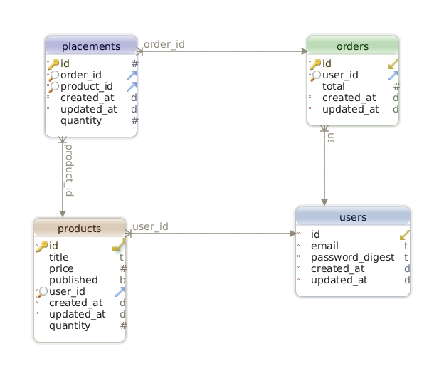

# Marketplace API

This is the Marketplace API for [*API On Rails*](https://leanpub.com/apionrails6) book.

## Getting started

To get started with the app, **clone** the repo and then install the needed gems:

```bash
bundle install
```

Next, migrate the database:

```bash
rails db:migrate
```

Finally, run the test suite to verify that everything is working correctly:

```bash
rails test
```

If the test suite passes, you'll be ready to run the app in a local server:

```bash
rails server
```


## Database Schema

<div align="center">

  

</div>
